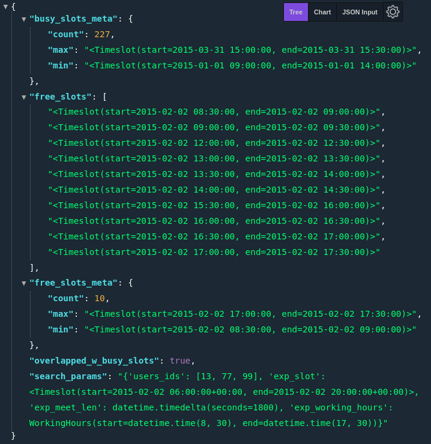
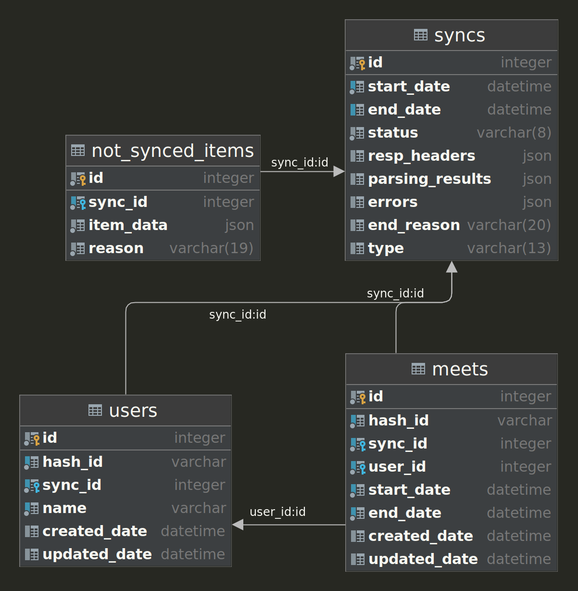
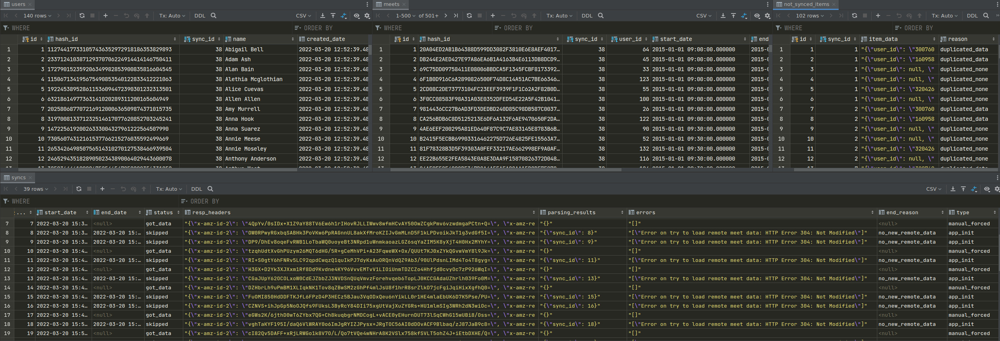
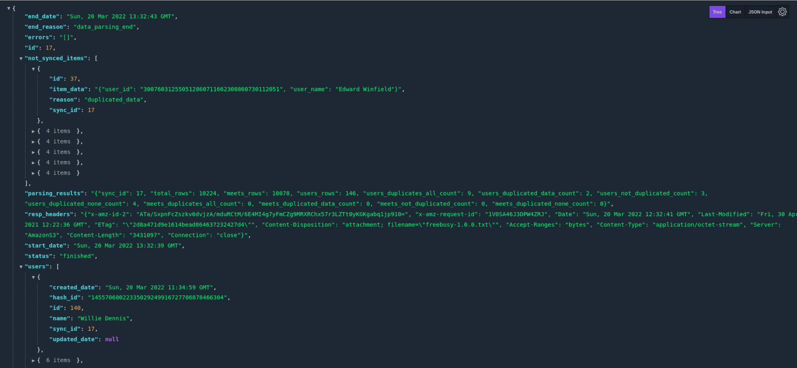
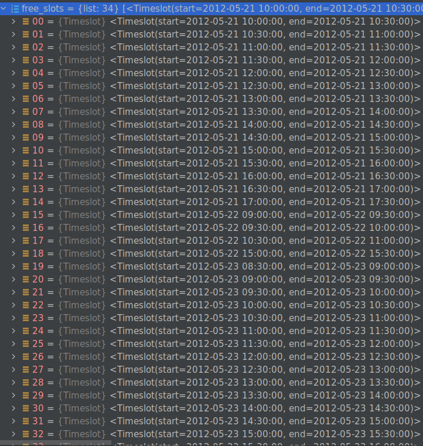

# ETL app to get suggestions for suitable meeting times

<p align="center">

</p>

## 1. Requirements

[Original requirements](info/assignment_2.0.pdf)

### Description

The mega-corporation Buffel & Båg AB has a custom-built system for handling
meetings which has been around since the beginning of time and which is now
deemed too difficult to use. Since management doesn’t know how important the
system is they have invested far too little resources in the upgrade project,
and have decided to hire a single poor contractor (guess who) to solve the most
important problems in almost no time. At regular intervals, all information is
dumped from the existing system to a text file that can be downloaded from a
publicly available API (see link further down). An excerpt from the file can
look like this:

```
170378154979885419149243073079764064027;Colin Gomez
170378154979885419149243073079764064027;2/18/2014 10:30:00 AM;2/18/2014 11:00:00 AM;485D2AEB9DBE3...
139016136604805407078985976850150049467;Minnie Callahan
139016136604805407078985976850150049467;2/19/2014 10:30:00 AM;2/19/2014 1:00:00 PM;C165039FC08AB4...
```

As it seems, the file has lines in two different formats where the first one
contains employee id and display name and the second format has information on
the time slots where the employee is busy and therefore not available for
meetings. Unfortunately, everyone who knew something about the old system has
fled the company a long time ago. Questions regarding how the system should
work can however be answered.

**Requirements:** \
As a first step, management has asked for an application implemented in the
browser. The application should provide a UI that makes it possible for users
to get suggestions for suitable meeting times based on the following
parameters:

• participants (employee ids), one or multiple \
• desired meeting length (minutes) \
• earliest and latest requested meeting date and time • office hours (e.g. 08-17)

**The following can be good to know:**

• In the file, all times are stated in UTC. To keep things simple, don’t bother
with implementing support for local date-times unless your solution gives you
that for free \
• People work every day of the week at Buffel & Båg AB \
• Due to the crappy state of the existing system the file may contain some
irregularities, these should be ignored \
• The system only handles meetings that start every full and half hour, e.g.
08.00, 08.30, 09.00, etc. \
• Make the solution work in Chrome, you can ignore all other browsers 

**Your solution will be evaluated on aspects like:**

• The structure and the quality of the code \
• How easy it is to understand \
• How you verify that the solution works

Keep in mind that a perfect solution is not the primary goal of the assignment,
but rather to see how you interpret and work on the problem and the code you
write. Link to the file:

https://builds.lundalogik.com/api/v1/builds/freebusy/versions/1.0.0/file

**When handing in the solution:**

• Please include a README explaining how to run the solution. \
• Please do not upload your result to a public site. 

## 2. Solution

### 2.1 Description
**DB schema after sync data** 

<p align="center">

</p>

[DB schema UML](meet_app/data/db_schema.uml)

**DB data representation**
<p align="center">

</p>

**Application work explanation:**

1) First sync is happening on the 1st app run time `app.py`
(in case app.run(debug=True) app will run 2 times - consider it). Then based on
settings.SYNC_INTERVAL value. All sync actions logged and stored to DB `Sync` table.
In case of regular sync and no new data from remote server it will be skipped,
to avoid spamming and redundant actions from app side.

2) There is a possibility to run sync manually via web handler: \
http://localhost:5000/load_data - regular sync
http://localhost:5000/load_data?forced=1 - forced sync
 - Successfully finished sync response:
```JSON
{
    "end_date": "Sat, 19 Mar 2022 13:12:43 GMT",
    "end_reason": "data_parsing_end",
    "errors": "[]",
    "id": 169,
    "parsing_results": "{\"total_rows\": 10224, \"meets_rows\": 10078, \"users_rows\": 146}",
    "resp_headers": "{\"x-amz-id-2\": \"2crDIt2C3mXXYl5hXFFyZwFHtR3+IgByRRUwMzWXwM5oBJjjN9s+qTdWEHl26LrcKyqdNrlwrMw=\", \"x-amz-request-id\": \"4460MDDH9XRVSVDD\", \"Date\": \"Sat, 19 Mar 2022 12:12:40 GMT\", \"Last-Modified\": \"Fri, 30 Apr 2021 12:22:36 GMT\", \"ETag\": \"\\\"2d8a471d9e1614bead864637232427d4\\\"\", \"Content-Disposition\": \"attachment; filename=\\\"freebusy-1.0.0.txt\\\"\", \"Accept-Ranges\": \"bytes\", \"Content-Type\": \"application/octet-stream\", \"Server\": \"AmazonS3\", \"Content-Length\": \"3431097\", \"Connection\": \"close\"}",
    "start_date": "Sat, 19 Mar 2022 13:12:38 GMT",
    "status": "finished",
    "users": [
        {
            "created_date": "Sun, 20 Mar 2022 00:43:54 GMT",
            "hash_id": "14557060022335029249916727706878466304",
            "id": 140,
            "name": "Willie Dennis",
            "sync_id": 322,
            "updated_date": null
        }
    ]
}
```

- Skipped due to no new content sync response:
```JSON
{
    "end_date": "Sat, 19 Mar 2022 13:15:37 GMT",
    "end_reason": "no_new_remote_data",
    "errors": "[\"Error on try to load remote meet data: HTTP Error 304: Not Modified\"]",
    "id": 171,
    "parsing_results": "{}",
    "resp_headers": "{\"x-amz-id-2\": \"NMv5ZsifxtypcrQsecznaW+ivuYkGhoxEW9ErbieQTUu2buvIff49qc1wxcnDRb1pjckW1P+E9U=\", \"x-amz-request-id\": \"RX5GVRJ8SBXM9D2W\", \"Date\": \"Sat, 19 Mar 2022 12:15:38 GMT\", \"Last-Modified\": \"Fri, 30 Apr 2021 12:22:36 GMT\", \"ETag\": \"\\\"2d8a471d9e1614bead864637232427d4\\\"\", \"Content-Disposition\": \"attachment; filename=\\\"freebusy-1.0.0.txt\\\"\", \"Server\": \"AmazonS3\", \"Connection\": \"close\"}",
    "start_date": "Sat, 19 Mar 2022 13:15:36 GMT",
    "status": "skipped"
}
```

3) During sync, remote data is parsed by pandas initially to 2 data frames 
(2 columns) of users and meets (columns) without deleting anything for future
analyze purposes.

4) Then from extracted pandas collections users data is storing to DB table
`users` using SA ORM as well as relation to `sync` table.
Not parsed items are storing to DB table `not_synced_items` with a reason desc.

5) Nex step is, from extracted pandas collections meets data is storing to 
DB table `meets` using SA ORM as well as relation to `sync` and users table.
Not parsed items are storing to DB table `not_synced_items` with a reason desc.

NOTE: Avoided data duplication.

6Added but not used migration mechanism via alembic with utils (
due to demo app)

7To use application need to run it locally `app.py` or via docker container.
See desc bellow.

8To find free slots: \
URL: 
http://localhost:5000/get_free_slots

Request via body (JS and dev tools):
```JS
fetch('http://localhost:5000/get_free_slots', {
    method: 'POST',
    body: JSON.stringify({
        'users_ids': '13,77,99',
        'start_date': '2015-02-02T06:00:00',
        'end_date': '2015-02-03T20:00:00',
        'meet_len': 30,
        'start_work': '08:30:00',
        'end_work': '17:30:00',
    }),
    headers: {
        'Content-type': 'application/json; charset=UTF-8',
    },
})
    .then((response) => response.json())
    .then((json) => console.log(json));
```

Request via query params: \
http://localhost:5000/get_free_slots?users_ids=13,77,99&start_date=2015-02-02T06:00:00&end_date=2015-02-03T20:00:00&meet_len=30&start_work=08:30:00&end_work=17:30:00

Response:
```JSON
{
    "busy_slots_meta": {
        "count": 227,
        "max": "<Timeslot(start=2015-03-31 15:00:00, end=2015-03-31 15:30:00)>",
        "min": "<Timeslot(start=2015-01-01 09:00:00, end=2015-01-01 14:00:00)>"
    },
    "free_slots": [
        "<Timeslot(start=2015-02-02 08:30:00, end=2015-02-02 09:00:00)>",
        "<Timeslot(start=2015-02-02 09:00:00, end=2015-02-02 09:30:00)>",
        "<Timeslot(start=2015-02-02 12:00:00, end=2015-02-02 12:30:00)>",
        "<Timeslot(start=2015-02-02 13:00:00, end=2015-02-02 13:30:00)>",
        "<Timeslot(start=2015-02-02 13:30:00, end=2015-02-02 14:00:00)>",
        "<Timeslot(start=2015-02-02 14:00:00, end=2015-02-02 14:30:00)>",
        "<Timeslot(start=2015-02-02 15:30:00, end=2015-02-02 16:00:00)>",
        "<Timeslot(start=2015-02-02 16:00:00, end=2015-02-02 16:30:00)>",
        "<Timeslot(start=2015-02-02 16:30:00, end=2015-02-02 17:00:00)>",
        "<Timeslot(start=2015-02-02 17:00:00, end=2015-02-02 17:30:00)>",
        "<Timeslot(start=2015-02-03 09:00:00, end=2015-02-03 09:30:00)>",
        "<Timeslot(start=2015-02-03 09:30:00, end=2015-02-03 10:00:00)>",
        "<Timeslot(start=2015-02-03 10:30:00, end=2015-02-03 11:00:00)>",
        "<Timeslot(start=2015-02-03 11:00:00, end=2015-02-03 11:30:00)>",
        "<Timeslot(start=2015-02-03 11:30:00, end=2015-02-03 12:00:00)>",
        "<Timeslot(start=2015-02-03 12:00:00, end=2015-02-03 12:30:00)>",
        "<Timeslot(start=2015-02-03 12:30:00, end=2015-02-03 13:00:00)>",
        "<Timeslot(start=2015-02-03 13:00:00, end=2015-02-03 13:30:00)>",
        "<Timeslot(start=2015-02-03 13:30:00, end=2015-02-03 14:00:00)>",
        "<Timeslot(start=2015-02-03 15:00:00, end=2015-02-03 15:30:00)>",
        "<Timeslot(start=2015-02-03 15:30:00, end=2015-02-03 16:00:00)>",
        "<Timeslot(start=2015-02-03 16:00:00, end=2015-02-03 16:30:00)>",
        "<Timeslot(start=2015-02-03 16:30:00, end=2015-02-03 17:00:00)>",
        "<Timeslot(start=2015-02-03 17:00:00, end=2015-02-03 17:30:00)>"
    ],
    "free_slots_meta": {
        "count": 24,
        "max": "<Timeslot(start=2015-02-03 17:00:00, end=2015-02-03 17:30:00)>",
        "min": "<Timeslot(start=2015-02-02 08:30:00, end=2015-02-02 09:00:00)>"
    },
    "overlapped_w_busy_slots": true,
    "search_params": "{'users_ids': [13, 77, 99], 'exp_slot': <Timeslot(start=2015-02-02 06:00:00+00:00, end=2015-02-03 20:00:00+00:00)>, 'exp_meet_len': datetime.timedelta(seconds=1800), 'exp_working_hours': WorkingHours(start=datetime.time(8, 30), end=datetime.time(17, 30))}"
}
```

[Example of full load data resp](meet_app/data/json/load_data_resp.json)


**Run the application:** 

1) Run via docker containers (To be updated!!!):

    - Install [docker](https://docs.docker.com/get-docker/)
      and [Docker Compose](https://docs.docker.com/compose/install/)
    - Build and run docker containers:
    ```sh
    docker-compose -f docker-compose.yml build
    docker-compose -f docker-compose.yml up
    sudo docker exec –it meet-app zsh
    ```
    - Pull and run docker containers:
    ```sh
    docker pull nestu/meet-app:core
    # https://docs.docker.com/engine/reference/run/
    ```
    NOTE: Public image is not created due to task limitation (private mode)

2) Run locally:

    - OS: Better Linux base but can be used other (even Win Linux virtual
    subsystem)
    - Install [Pyton >= 3.10](https://www.python.org/downloads/) with pip
    - Install Python dependency management and packaging tool [poetry](https://python-poetry.org/docs/)
    - Install dependencies to .venv dir of the project
    ```sh
    source .venv/bin/activate
    poetry config virtualenvs.in-project true
    poetry shell
    poetry install
    ```
   - Run application using bash script: \
  `cd scripts ; ./run_app_sql_ver.sh` \
   - CLI: \
   `export IS_DEPLOY='0' IS_SQL_VERSION='1' && python3 meet_app/app.py run --port=5000 --host=0.0.0.0 --without-threads`
   

### 2.2 TODO
*In scope:*
- Create docker container and push to docker hub. Add desc to README.MD
- Unit and integration tests
- UI to find free slots

*Backlog:*
- Logging and timeing
- Code cleanup and refactoring
- MySQL version + Docker redo
- E2E tests * Since UI ready
- Add deploy version and desc
- Deploy application to cloud (GCP, AWS ?)

### 2.3 Examples
1. Result of sync response via web handler:
<p align="center">

</p>

2. Got free slots IDE example output: \
[BUSY_SLOTS input](meet_app/infra/find_free_slots.BUSY_SLOTS)

<p align="center">

</p>


3. Not synced items table:

| reason | id | sync\_id | item\_data |
| :--- | :--- | :--- | :--- |
| duplicated\_data | 1 | 1 | "{\\"user\_id\\": \\"300760312550512860711662300860730112051\\", \\"user\_name\\": \\"Edward Winfield\\"}" |
| duplicated\_data | 2 | 1 | "{\\"user\_id\\": \\"160958802196100808578296561932835503894\\", \\"user\_name\\": \\"Elizabeth Bravo\\"}" |
| duplicated\_none | 3 | 1 | "{\\"user\_id\\": null, \\"user\_name\\": null}" |
| duplicated\_none | 4 | 1 | "{\\"user\_id\\": null, \\"user\_name\\": null}" |
| duplicated\_none | 5 | 1 | "{\\"user\_id\\": \\"320426673944415970493216791331086532677\\", \\"user\_name\\": NaN}" |
| duplicated\_none | 6 | 1 | "{\\"user\_id\\": null, \\"user\_name\\": null}" |
| not\_recognized\_data | 7 | 1 | "{\\"user\_id\\": \\"122738134777317151430937745278085616415\\", \\"meet\_start\_date\\": \\"1/1/2015 12:00:0\\", \\"meet\_end\_date\\": \\"1/1/2015 12:00:00 AM\\", \\"meet\_id\\": \\"05BD3C3EDC63D66D4A08A02E8C06A991566A81F9ECF1CD5D872291BFA7F38C8B651CD61CF3EC01684263F3BE743A7F5016F3B513C72AB42054B7D6588C3EE80B7596622E4F4E531AC6DE8003FDEAEFFF69202F17C0884CADE0075F013CEA5BDFB374CEB2E08B7F8DCD8E816C0B1B8D9DAFDCAE624AA7833EBA8B6BB2166118FF\\", \\"Index\\": 9720.0}" |
| not\_recognized\_data | 8 | 1 | "{\\"user\_id\\": \\"132170847144391420901310654714918986833\\", \\"meet\_start\_date\\": \\"1/1/2015 2:00:00 PM\\", \\"meet\_end\_date\\": \\"1/1/2015 9:00:00 AM\\", \\"meet\_id\\": \\"2E778D76EA0017CF8A9E9397AA2E232C9BCCBCA6DA1948B7B8956C33B4BC281CC5D5F1FC53FA551B3E17AD07B2355B5C25A3A329EB74E5295E3ACE954D98F52DD730757AE6872AC3C080E89A9E0533D508C904A9541EEAFCA85BAC6F06691E85B4F90C6833786A281B6BC4EE3497F2882AB678EEC0D0325A20A4B3B85411DD21\\", \\"Index\\": 7061.0}" |
| duplicated\_data | 9 | 2 | "{\\"user\_id\\": \\"300760312550512860711662300860730112051\\", \\"user\_name\\": \\"Edward Winfield\\"}" |
| duplicated\_data | 10 | 2 | "{\\"user\_id\\": \\"160958802196100808578296561932835503894\\", \\"user\_name\\": \\"Elizabeth Bravo\\"}" |
| duplicated\_none | 11 | 2 | "{\\"user\_id\\": null, \\"user\_name\\": null}" |
| duplicated\_none | 12 | 2 | "{\\"user\_id\\": null, \\"user\_name\\": null}" |
| duplicated\_none | 13 | 2 | "{\\"user\_id\\": \\"320426673944415970493216791331086532677\\", \\"user\_name\\": NaN}" |
| duplicated\_none | 14 | 2 | "{\\"user\_id\\": null, \\"user\_name\\": null}" |
| not\_recognized\_data | 15 | 2 | "{\\"user\_id\\": \\"122738134777317151430937745278085616415\\", \\"meet\_start\_date\\": \\"1/1/2015 12:00:0\\", \\"meet\_end\_date\\": \\"1/1/2015 12:00:00 AM\\", \\"meet\_id\\": \\"05BD3C3EDC63D66D4A08A02E8C06A991566A81F9ECF1CD5D872291BFA7F38C8B651CD61CF3EC01684263F3BE743A7F5016F3B513C72AB42054B7D6588C3EE80B7596622E4F4E531AC6DE8003FDEAEFFF69202F17C0884CADE0075F013CEA5BDFB374CEB2E08B7F8DCD8E816C0B1B8D9DAFDCAE624AA7833EBA8B6BB2166118FF\\", \\"Index\\": 9720.0}" |
| not\_recognized\_data | 16 | 2 | "{\\"user\_id\\": \\"132170847144391420901310654714918986833\\", \\"meet\_start\_date\\": \\"1/1/2015 2:00:00 PM\\", \\"meet\_end\_date\\": \\"1/1/2015 9:00:00 AM\\", \\"meet\_id\\": \\"2E778D76EA0017CF8A9E9397AA2E232C9BCCBCA6DA1948B7B8956C33B4BC281CC5D5F1FC53FA551B3E17AD07B2355B5C25A3A329EB74E5295E3ACE954D98F52DD730757AE6872AC3C080E89A9E0533D508C904A9541EEAFCA85BAC6F06691E85B4F90C6833786A281B6BC4EE3497F2882AB678EEC0D0325A20A4B3B85411DD21\\", \\"Index\\": 7061.0}" |

